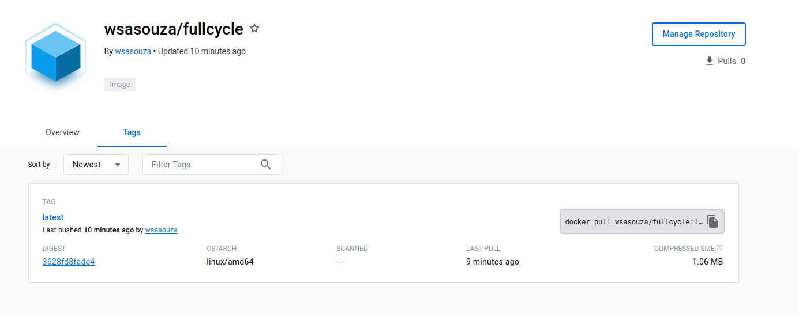
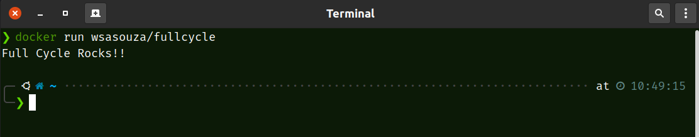

<div align="center" id="top"> 
  <h1>FCLX - Desafio 1</h1>
  <h2>Docker Hub</h2>
  
  <br>
  <br>
  <h2>Resultado:</h2>
    
  <br>
  <br>

&#xa0;

  <!-- <a href="https://fclxdesafio1.netlify.app">Demo</a> -->
</div>

<p align="center">
  

  

  

  
  
</p>

<p align="center">
  <a href="#dart-about">About</a> &#xa0; | &#xa0; 
  <a href="#sparkles-features">Features</a> &#xa0; | &#xa0;
  <a href="#rocket-technologies">Technologies</a> &#xa0; | &#xa0;
  <a href="#white_check_mark-requirements">Requirements</a> &#xa0; | &#xa0;
  <a href="#checkered_flag-starting">Starting</a> &#xa0; | &#xa0;
  <a href="#memo-license">License</a> &#xa0; | &#xa0;
  <a href="https://github.com/wsasouza" target="_blank">Author</a>
</p>

<br>

## :dart: About

Objetivo do desafio:

Você terá que publicar uma imagem no docker hub e quando executarmos:

```bash
docker run wsasouza/fullcycle
```

Temos que ter o seguinte resultado: Full Cycle Rocks!!

## :rocket: Technologies

The following tools were used in this project:

- [DockerHub](https://hub.docker.com/r/wsasouza/fullcycle)
- [Docker](https://www.docker.com/)
- [Golang](https://go.dev/)

## :white_check_mark: Requirements

Before starting :checkered_flag:, you need to have [Git](https://git-scm.com) and [Docker](https://www.docker.com/) installed.

## :checkered_flag: Starting

```bash
# Clone this project
$ git clone https://github.com/wsasouza/fclx-desafio-1

# Access
$ cd fclx-desafio-1

```

## :memo: License

This project is under license from MIT. For more details, see the [LICENSE](LICENSE.md) file.

Made with :heart: by <a href="https://github.com/wsasouza" target="_blank">Walter Santos de Andrade Souza</a>

&#xa0;

<a href="#top">Back to top</a>
